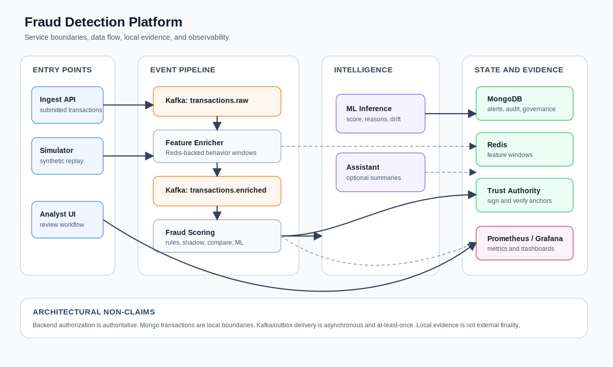
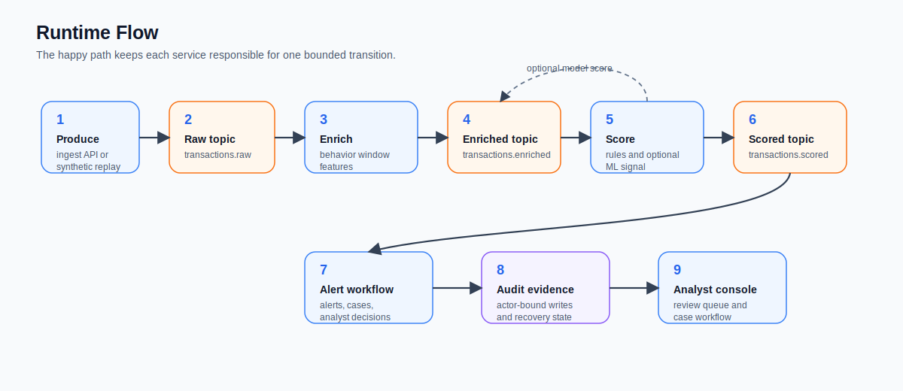
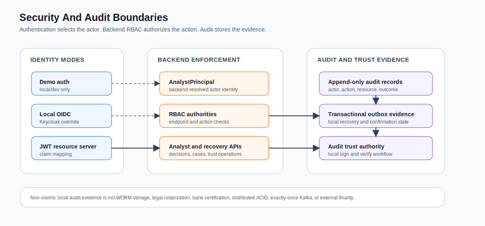

# Fraud Detection Platform

Production-style fraud detection platform implemented as a multi-service monorepo. The system ingests or generates
transactions, enriches them with behavioral features, scores fraud risk, creates analyst alerts and fraud cases, and
supports secured analyst workflows with RBAC, audit logging, evidence tracking, and local observability.

The repository intentionally uses platform-owned synthetic data. Third-party fraud datasets should stay local and
outside public Git history.

## Contents

- [System Overview](#system-overview)
- [Architecture](#architecture)
- [Runtime Flow](#runtime-flow)
- [Security And Audit Boundaries](#security-and-audit-boundaries)
- [Local Development](#local-development)
- [Services And Ports](#services-and-ports)
- [Testing](#testing)
- [Documentation Map](#documentation-map)
- [Project Layout](#project-layout)
- [Production Posture](#production-posture)

## System Overview

The platform is built around explicit service ownership and event-driven handoff:

| Area | Owner | Responsibility |
| --- | --- | --- |
| Transaction ingestion | `transaction-ingest-service` | REST entry point for submitted transactions. |
| Synthetic replay | `transaction-simulator-service` | Local/demo traffic generation from synthetic scenarios. |
| Feature enrichment | `feature-enricher-service` | Redis-backed feature windows and derived fraud signals. |
| Fraud scoring | `fraud-scoring-service` | Rule scoring plus ML integration in rule, shadow, ML, or compare modes. |
| ML runtime | `ml-inference-service` | Python model inference, governance snapshots, drift and advisory endpoints. |
| Alert workflow | `alert-service` | Alerts, fraud cases, analyst decisions, RBAC, audit, recovery, and regulated mutation controls. |
| Trust authority | `audit-trust-authority` | Local signing and verification authority for audit anchor material. |
| Analyst UI | `analyst-console-ui` | React console for monitoring, alert review, case workflow, and security UX. |
| Shared contracts | `common-events` | Kafka event contracts and shared value objects. |

Core capabilities:

- Kafka-based transaction pipeline with bounded local service responsibilities.
- Fraud scoring with deterministic rule mode and ML-assisted modes.
- Alert and fraud-case workflows for analyst review.
- Backend-authoritative RBAC and frontend session-aware UX.
- Append-only platform audit records and local trust-authority signing.
- Local Prometheus/Grafana observability.
- CI evidence mapping and branch-evidence governance for FDP work.

## Architecture



Design boundaries:

- Kafka contracts live in `common-events`.
- REST DTOs and persistence models stay service-local unless deliberately promoted.
- Backend authorization is authoritative; frontend gating is only UX.
- Mongo transaction mode is a local boundary, not distributed ACID.
- Kafka/outbox delivery remains asynchronous and at-least-once unless a later implemented control proves otherwise.

## Runtime Flow



Risk scoring modes:

| Mode | Final score owner | Purpose |
| --- | --- | --- |
| `RULE_BASED` | Java rules | Deterministic default scoring. |
| `SHADOW` | Java rules | Attach ML diagnostics without changing final decisions. |
| `COMPARE` | Java rules | Compare rules and ML for operational analysis. |
| `ML` | Python model | Use ML result with rule fallback when unavailable. |

## Security And Audit Boundaries



Security model:

- Demo auth is local/dev only and guarded by profile checks.
- Local OIDC uses Keycloak through the Docker override.
- JWT Resource Server support maps external claims into `AnalystPrincipal`.
- Actor identity for secured write paths comes from the authenticated principal, not request payload fields.
- RBAC authorities protect analyst, audit, recovery, outbox, and trust incident endpoints.

Audit and trust model:

- Analyst write actions and governance advisory reviews are persisted as append-only audit records.
- Regulated mutation and outbox controls are local evidence controls, not external finality.
- The local trust authority signs and verifies audit anchor material for local proof workflows.
- The repository does not claim WORM storage, legal notarization, bank certification, distributed ACID, or exactly-once Kafka.

Start with:

- [Security architecture](docs/security/security_architecture.md)
- [Current architecture](docs/architecture/current_architecture.md)
- [Alert service source of truth](docs/architecture/alert_service_source_of_truth.md)
- [Public API semantics](docs/api/public_api_semantics.md)

## Local Development

Docker is the supported local runtime path for this README.

Default demo stack:

```bash
docker compose -f deployment/docker-compose.yml up --build -d
```

Local OIDC stack:

```bash
docker compose -f deployment/docker-compose.yml -f deployment/docker-compose.oidc.yml up --build -d
```

JWT service-identity stack:

```bash
docker compose -f deployment/docker-compose.yml -f deployment/docker-compose.service-identity-jwt.yml up --build -d
```

RS256 service-identity stack:

```bash
docker compose -f deployment/docker-compose.yml -f deployment/docker-compose.service-identity-rs256.yml up --build -d
```

mTLS service-identity stack:

```bash
docker compose -f deployment/docker-compose.yml -f deployment/docker-compose.service-identity-mtls.yml up --build -d
```

Full local security stack:

```bash
docker compose \
  -f deployment/docker-compose.yml \
  -f deployment/docker-compose.oidc.yml \
  -f deployment/docker-compose.service-identity-mtls.yml \
  -f deployment/docker-compose.trust-authority-jwt.yml \
  up --build -d
```

Open:

- Analyst console: `http://localhost:4173`
- Alert service: `http://localhost:8085`
- ML inference service: `http://localhost:8090`
- Prometheus: `http://localhost:9090`
- Grafana: `http://localhost:3000` (`admin` / `admin`)
- Keycloak, when OIDC is enabled: `http://localhost:8086`

Stop the stack:

```bash
docker compose -f deployment/docker-compose.yml down
```

Stop the full local security stack:

```bash
docker compose \
  -f deployment/docker-compose.yml \
  -f deployment/docker-compose.oidc.yml \
  -f deployment/docker-compose.service-identity-mtls.yml \
  -f deployment/docker-compose.trust-authority-jwt.yml \
  down
```

## Services And Ports

| Service | Local URL | Notes |
| --- | --- | --- |
| `analyst-console-ui` | `http://localhost:4173` | React analyst console served by nginx. |
| `transaction-ingest-service` | `http://localhost:8081` | REST transaction ingestion. |
| `transaction-simulator-service` | `http://localhost:8082` | Synthetic replay and generated traffic. |
| `feature-enricher-service` | `http://localhost:8083` | Feature windows and enrichment. |
| `fraud-scoring-service` | `http://localhost:8084` | Rule and ML-assisted scoring. |
| `alert-service` | `http://localhost:8085` | Alerts, cases, audit, RBAC, recovery APIs. |
| `ml-inference-service` | `http://localhost:8090` | Python inference and governance API. |
| `audit-trust-authority` | `http://localhost:8095` | Local audit-signing authority. |
| `keycloak` | `http://localhost:8086` | Local OIDC override only. |
| `kafka` | `127.0.0.1:9092` | Local broker. |
| `mongodb` | `127.0.0.1:27017` | Local persistence. |
| `redis` | `127.0.0.1:6379` | Feature windows and local state. |
| `prometheus` | `http://localhost:9090` | Metrics and alert rules. |
| `grafana` | `http://localhost:3000` | Provisioned dashboards. |
| `ollama` | `http://localhost:11434` | Optional local assistant model runtime. |

## Testing

Backend:

```bash
mvn test
```

Single backend module:

```bash
mvn -pl alert-service -am test
```

Frontend:

```bash
cd analyst-console-ui
npm test
npm run build
```

ML service:

```bash
cd ml-inference-service
python -m unittest discover -s tests
python -m compileall app tests
```

Documentation and CI governance checks:

```bash
node scripts/check-doc-overclaims.mjs
node scripts/compare-ci-jobs.mjs
node scripts/check-fdp-scope-helpers-smoke.mjs
```

Integration tests use Docker/Testcontainers where applicable and are skipped automatically when Docker is not
available.

## Documentation Map

The README is intentionally short. Detailed contracts live in focused documentation:

| Need | Start here |
| --- | --- |
| Current repository docs | [Documentation index](docs/index.md) |
| Architecture and diagrams | [Architecture documentation](docs/architecture/index.md) |
| API contracts and error semantics | [API documentation](docs/api/index.md) |
| Security, auth, RBAC, audit | [Security documentation](docs/security/index.md) |
| Fraud-case lifecycle | [Fraud case management](docs/product/fraud_case_management.md) |
| ML governance and drift | [ML governance and drift](docs/ml/ml_governance_drift_v1.md) |
| Observability | [Operations and observability](docs/observability/operations_observability_v2.md) |
| FDP branch records | [FDP branch evidence](docs/fdp/index.md) |
| CI evidence mapping | [CI evidence map](docs/ci_evidence_map.md) |
| Reviewer flow | [Reviewer checklist](docs/reviewer_checklist.md) |

## Project Layout

```text
common-events/                  Shared Kafka contracts and value objects
common-test-support/            Shared fixtures and Testcontainers helpers
transaction-ingest-service/      REST transaction ingestion
transaction-simulator-service/   Synthetic replay and generated traffic
feature-enricher-service/        Redis-backed feature enrichment
fraud-scoring-service/           Rule and ML-assisted scoring
ml-inference-service/            Python model inference and governance API
alert-service/                   Alerts, cases, audit, RBAC, recovery APIs
audit-trust-authority/           Local trust-signing authority
analyst-console-ui/              React analyst console
deployment/                      Docker Compose, service images, monitoring config
docs/                            Architecture, API, security, runbooks, FDP evidence
scripts/                         CI, docs, scope, and dataset helpers
```

## Production Posture

Implemented production-style foundations:

- Service boundaries with Kafka contracts and local persistence ownership.
- RBAC and backend-authoritative authorization for analyst workflows.
- Durable local audit records and bounded integrity/trust workflows.
- Regulated mutation, outbox, and recovery evidence for selected workflows.
- Local OIDC, service identity foundations, and mTLS-scoped internal calls.
- CI gates and documentation evidence for branch-level changes.

Explicit non-claims:

- No bank certification.
- No production deployment approval.
- No legal notarization or WORM certification.
- No distributed ACID.
- The platform does not provide exactly-once Kafka delivery.
- No external finality unless a current source-of-truth document names the implemented control and its limitations.

## Maintainer

Milosz Podsiadly  
[m.podsiadly99@gmail.com](mailto:m.podsiadly99@gmail.com)  
[GitHub - MiloszPodsiadly](https://github.com/MiloszPodsiadly)

## License

Licensed under the [MIT License](https://opensource.org/licenses/MIT).
