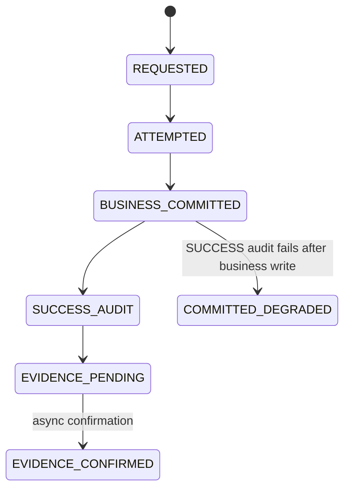
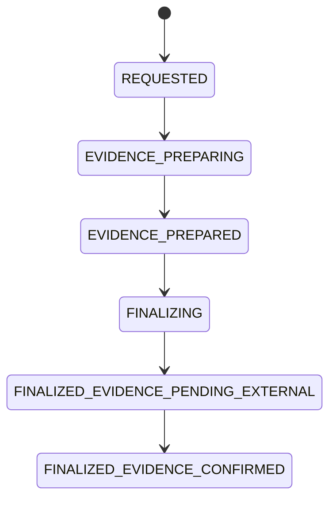
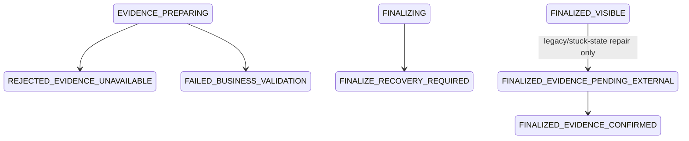

# ADR: FDP-29 Local Evidence-Precondition-Gated Finalize

## Status

Feature-flagged submit-decision implementation prototype plus design contract. FDP-29 changes runtime behavior only when both `app.regulated-mutations.evidence-gated-finalize.enabled=true` and `app.regulated-mutations.evidence-gated-finalize.submit-decision.enabled=true` are configured. The default remains disabled. The precise implemented scope is local evidence-precondition-gated finalize, not external finality.

## Problem

The current regulated mutation model can make business state visible before all required success evidence is fully ready. FDP-24 through FDP-28 made this gap explicit with durable degradation detection, recovery states, transactional outbox evidence, and invariant tests, but they do not eliminate the post-commit evidence window transactionally.

The design question for FDP-29 is:

> When may regulated business state become visible as committed?

## Decision

Regulated mutations should use an evidence-gated finalize model. FDP-29 implements this model only for submit-decision. A mutation may expose updated business state only after locally verifiable evidence preconditions pass. External evidence publication, remote signing readiness, witness policy readiness, and broker delivery confirmation remain eventual effects or future target gates and must not be described as part of the local transaction.

Core invariant:

> No regulated business mutation is exposed as `FINALIZED_VISIBLE` before its evidence gate passes.

## Current Model

## Proposed Evidence-Gated Model

## Failure and Recovery Branches

## Target State Flow

1. `REQUESTED`
2. `EVIDENCE_PREPARING`
3. `EVIDENCE_PREPARED`
4. `FINALIZING`
5. `FINALIZED_EVIDENCE_PENDING_EXTERNAL`
6. `FINALIZED_EVIDENCE_CONFIRMED`

`FINALIZED_VISIBLE` is retained as a compatibility/repair state for previously persisted or interrupted commands. New FDP-29 submit-decision finalization persists `FINALIZED_EVIDENCE_PENDING_EXTERNAL` as the durable local-visible state inside the local Mongo transaction.

Rejected or recovery states:

- `REJECTED_EVIDENCE_UNAVAILABLE`
- `FAILED_BUSINESS_VALIDATION`
- `FINALIZE_RECOVERY_REQUIRED`

## Current Implementation vs Target Design

FDP-29 v1 currently enforces the following before or inside the local submit-decision finalize path:

- `mutation_model_version=EVIDENCE_GATED_FINALIZE_V1`
- `app.regulated-mutations.transaction-mode=REQUIRED`
- startup-verified Mongo transaction capability
- startup-verified transactional outbox repository
- startup-verified outbox recovery and submit-decision recovery strategy
- durable `ATTEMPTED` audit phase before visible mutation
- deterministic `SUCCESS` audit phase key availability
- backend-resolved actor/resource/action intent consistency
- submit-decision business validation against current alert state
- local Mongo transaction covering alert decision write, authoritative transactional outbox record, response snapshot, local success audit write through `RegulatedMutationLocalAuditPhaseWriter`, and local finalize marker
- durable command state `FINALIZED_EVIDENCE_PENDING_EXTERNAL` for new successful FDP-29 submit-decision commands

The target design may later add stronger pre-finalize gates for:

- external anchor readiness
- Trust Authority signing readiness
- external witness policy readiness
- independent evidence witness availability
- stronger pre-commit evidence reservation

Those target gates are not claimed by FDP-29 v1 unless implemented and tested in a later FDP.

## Local SUCCESS Audit Writer

FDP-29 uses `RegulatedMutationLocalAuditPhaseWriter` only for local `SUCCESS` audit evidence inside the local Mongo finalize transaction. It writes to the same authoritative `audit_events` collection, uses the same deterministic phase key pattern (`commandId:SUCCESS`), and writes the same local audit-chain and local anchor model as the platform audit store.

The writer intentionally does not call `AuditService`, `AuditEventPublisher`, Kafka publishers, or external anchor publishers. External publication, signature checks, and independent witness evidence remain asynchronous and outside local ACID.

This is not a second audit source of truth. It is a narrow local transaction primitive for the FDP-29 submit-decision finalize path only. Any broader use requires architecture review.

Local `SUCCESS` audit inside the transaction is local evidence only. It is not external finality, legal notarization, WORM storage, distributed ACID, or independent witness proof. Integration tests cover concurrent FDP-29 finalizations and prove no duplicate `SUCCESS` phase, duplicate chain position, duplicate anchor, or audit-chain fork for the local writer path.

The evidence-gated execution body is isolated in `EvidenceGatedFinalizeExecutor`. The shared Mongo coordinator creates or loads commands, validates idempotency, and routes by mutation model version; it does not own FDP-29 evidence preparation or the local finalize transaction body. This boundary is covered by architecture tests to avoid adding more model-specific branches to the shared coordinator.

The local writer retry policy is configurable and bounded. FDP-29 startup fails closed when the writer bean, retry policy, chain index initializer, or required unique indexes are missing or unsafe. Contention and lock-release failures are exposed through low-cardinality operational metrics; those metrics are not compliance evidence.

## Definition of Visible Business Commit

Visible business commit means a client, downstream consumer, or evidence export can treat the regulated business mutation as committed. It does not include internal pending command storage.

For `AlertDocument`, visible means the analyst decision fields, decision actor fields, decision timestamps, and any authoritative decision status become observable through alert read APIs or downstream decision events.

For `FraudCaseDocument`, visible means case status, assignee, decision notes, tags, and case update timestamps become observable through fraud-case read APIs or downstream case projections.

For API responses, visible means the endpoint returns the updated business resource or committed business fields. Until `FINALIZED_VISIBLE` or stronger, responses must use pending/recovery status bodies and may include only the current snapshot or command inspection state, not the updated resource as committed.

For downstream outbox events, visible means a transactional outbox record exists for the finalized mutation and may later be published at least once. Kafka publication is not part of the local finalize transaction.

For audit and evidence export, visible means the local command, attempted evidence, response snapshot, local finalize marker, and local success evidence are queryable as the committed mutation record. External witness confirmation may still be pending.

Internal pending mutation state may be stored before visible commit. Operators may inspect bounded pending command metadata through authorized operational endpoints. External business clients must not see pending state as committed business state.

Fields that must remain unchanged until finalize include:

- alert decision fields
- fraud-case business fields
- authoritative lifecycle/status fields
- transactional outbox publishable payloads
- response snapshots that claim committed updated state

Fields that may show pending state include:

- command state
- operational inspection status
- pending evidence status
- trust/degradation signals
- bounded operator-only pending metadata

The model distinguishes four surfaces:

- internal pending mutation state
- externally visible committed business state
- operational inspection state
- downstream event visibility

## ACID Boundary and External Effects

The local Mongo ACID boundary may include:

- command state transition
- business aggregate visible mutation
- transactional outbox record
- response snapshot
- local finalize marker

Outside local ACID:

- Kafka publish
- external witness publication
- remote Trust Authority signing, when remote
- external evidence confirmation
- broker delivery confirmation
- legal or notarial proof

Local ACID means only Mongo-local writes inside one Mongo transaction. Kafka, external anchors, Trust Authority calls, and broker confirmations must not be documented as part of that transaction.

## Compatibility With Existing FDP Statuses

FDP-25/FDP-26/FDP-27/FDP-28 statuses remain valid for legacy commands and replay. FDP-29 maps old command states into the new model without changing historical meaning. For example:

- `COMMITTED_EVIDENCE_PENDING` maps to `FINALIZED_EVIDENCE_PENDING_EXTERNAL`.
- `COMMITTED_EVIDENCE_INCOMPLETE` and `COMMITTED_DEGRADED` map to finalized-with-degraded-evidence compatibility states, not to `FINALIZED_EVIDENCE_CONFIRMED`.
- `RECOVERY_REQUIRED` maps to `FINALIZE_RECOVERY_REQUIRED` when finalization safety cannot be proven.
- `PUBLISH_CONFIRMATION_UNKNOWN` remains outbox evidence ambiguity after local finalize and must not be treated as exactly-once publication.

Detailed mapping is defined in `docs/architecture/FDP-29-compatibility-matrix.md`.

## Non-Goals

FDP-29 does not claim:

- distributed ACID
- exactly-once Kafka
- external witness inside local transaction
- legal notarization
- WORM storage
- KMS/HSM-backed signing
- zero external failure
- no need for recovery
- no need for outbox
- no need for evidence confirmation
- new business workflows
- UI dashboard changes
- process-kill chaos implementation

Allowed claim:

> FDP-29 implements a disabled-by-default submit-decision prototype where visible local business finalize is gated by locally verifiable evidence preconditions.

Disallowed shorthand:

> FDP-29 provides full evidence-gated commit.

That wording is too broad because external anchors, remote signing, Kafka delivery, WORM storage, and legal proof are outside the local finalize transaction.

## Consequences

Implementation remains intentionally narrow. Fraud-case update, trust incident writes, and outbox confirmation resolution are not migrated to this model by FDP-29.

Future hardening should expand direct production-chaos and process-kill coverage, especially around no-visible-mutation-before-finalize, idempotent replay, legacy replay, outbox ambiguity, and external evidence degradation.
