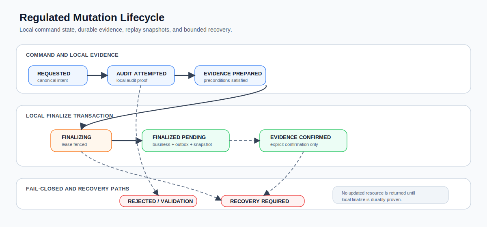
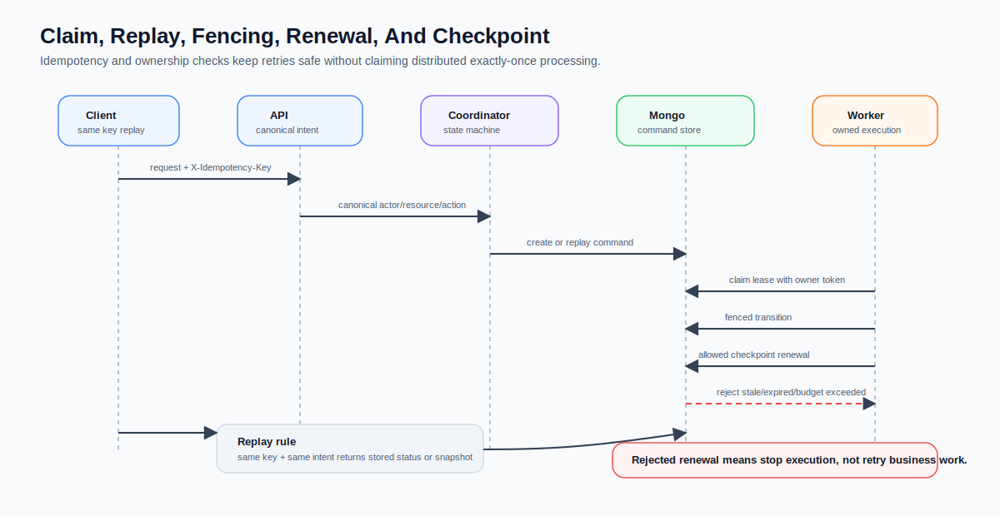
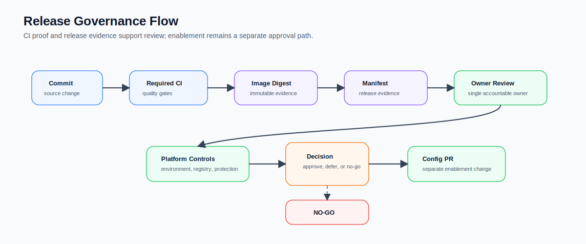
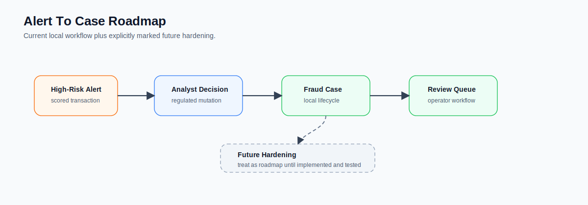

# Architecture Diagrams

Status: current portfolio diagrams.

## Scope

These diagrams are simplified reviewer aids. They summarize implemented service boundaries and known regulated
mutation concepts, but they are not a complete architecture proof and do not replace code-level contracts.

## System Architecture

The platform is event-driven through Kafka topics, with REST APIs at service boundaries. Alert service owns regulated
mutation state, local evidence, response snapshots, and analyst-facing alert workflows.

## Runtime Flow

The runtime path keeps each service responsible for one bounded transition: ingestion, enrichment, scoring, alert
projection, analyst review, and audit-backed state changes.

## Regulated Mutation Lifecycle

The lifecycle separates command intake, local audit evidence, business mutation, outbox publication, replay snapshots,
and recovery. It does not claim external finality, distributed ACID, or exactly-once Kafka delivery.

## Claim, Replay, Fencing, Renewal, And Checkpoint

Replay is idempotent for the same canonical intent. Lease fencing and checkpoint renewal preserve bounded ownership;
they are not progress signals and they do not allow a worker to continue after a rejected renewal.

## Release Governance Flow

Release-control documents are readiness evidence. They do not approve production enablement by themselves; enablement
requires separate owner review, environment controls, and configuration change approval.

## Alert To Case Roadmap

Current alert decisions and fraud-case workflows are implemented locally. Future case-management hardening remains
roadmap until code and tests establish the behavior.
