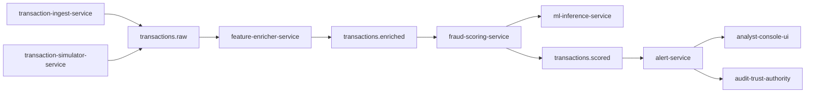
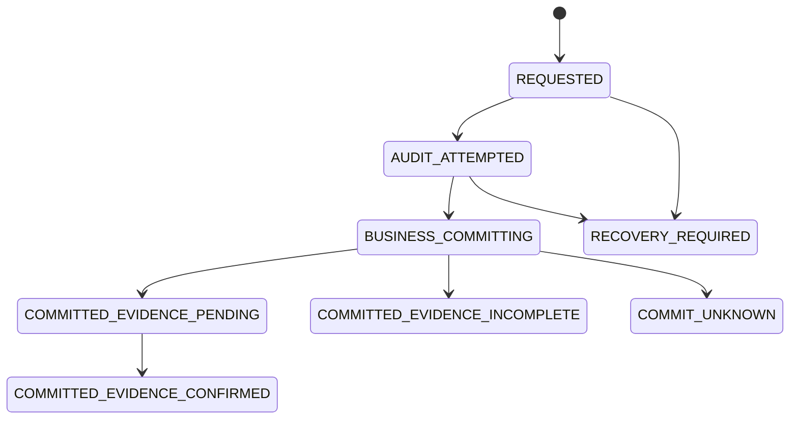
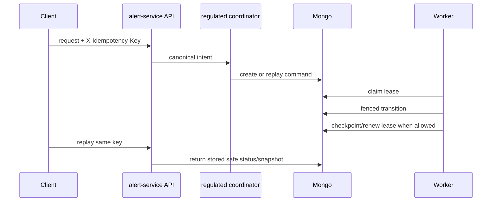
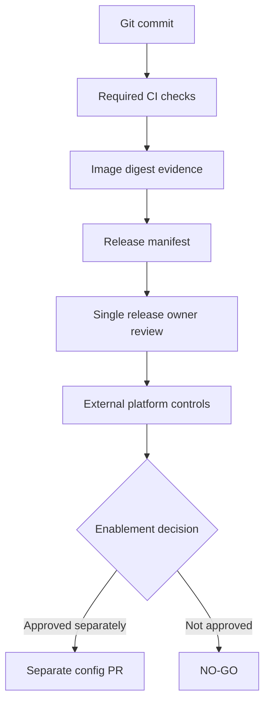
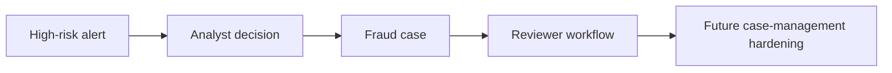

# Architecture Diagrams

Status: current portfolio diagrams.

## Scope

These diagrams are simplified reviewer aids. They summarize implemented service boundaries and known regulated
mutation concepts, but they are not a complete architecture proof and do not replace code-level contracts.

## High-Level Module Flow

The flow is event-driven through Kafka topics, with REST APIs at service boundaries.

## Regulated Mutation Lifecycle

The diagram is simplified. It does not claim external finality or distributed ACID.

## Claim, Replay, Fencing, Renewal, And Checkpoint

Replay is idempotent for the same canonical intent. It is not distributed exactly-once processing.

## Release Governance Flow

FDP-40 and later release-control docs are readiness evidence. They are not production approval by themselves.

## Alert To Case Roadmap

Case-management hardening beyond the current implementation must be treated as roadmap until implemented.
